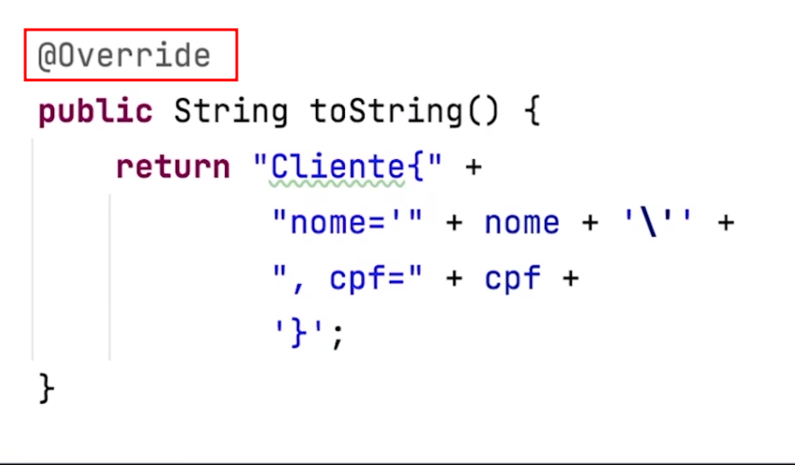
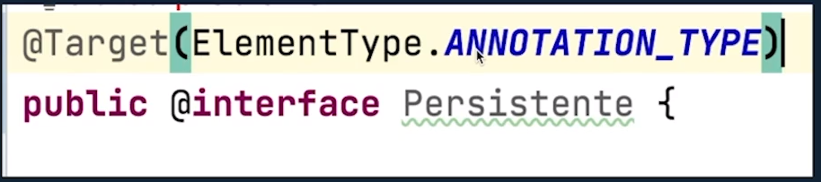
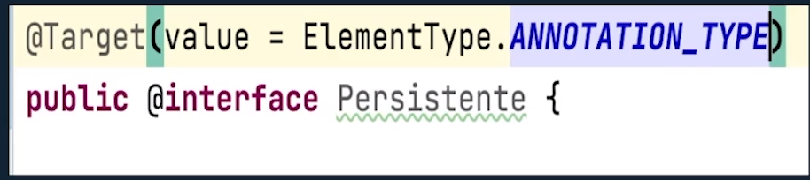
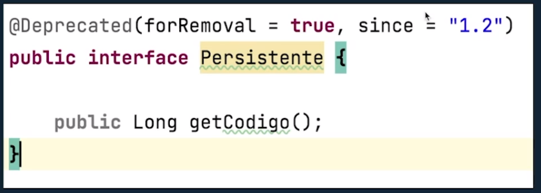
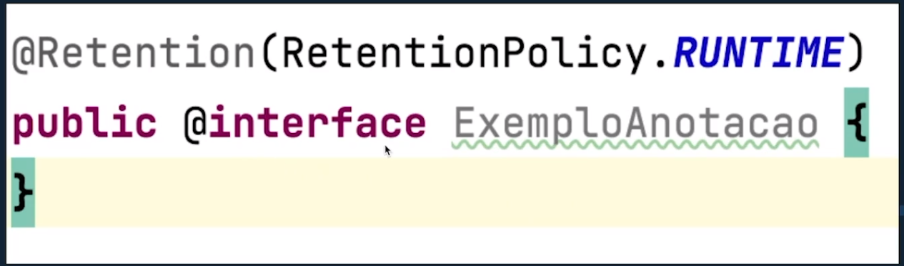
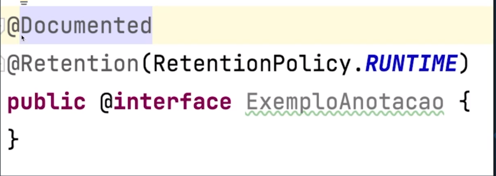
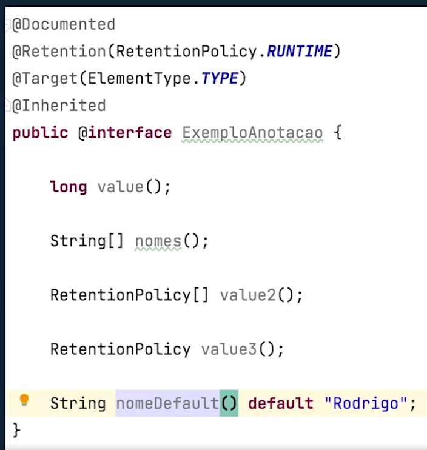
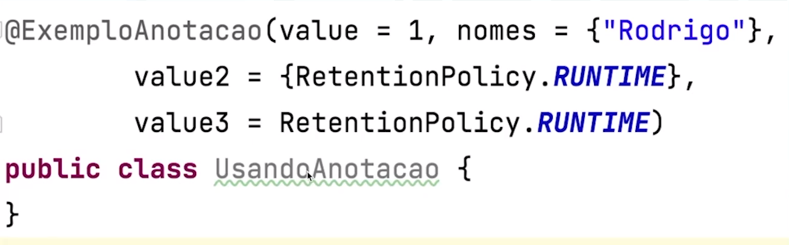

# ANNOTATIONS 

As anotações Java são um mecanismo para adicionar informações de metadados ao nosso código fonte.
Elas foram introduzidas na versão 5 do Java.

Embora possamos anexá-las a classes, interfaces, métodos e campos, as anotações por si mesmas não tem efeito na execução de um programa.
É preciso de uma outra inteligência para a leitura das mesmas, como **Reflection**.

## O que são?

Para definir uma anotação no código java, usamos o símbolo arroba (@) seguido do nome da mesma. Dependendo da categoria da annotation, pode ser necessário incluir dados a ela, no formato de pares nome=valor.

### Exemplo

## Tipos de annotations
* Annotations marcadoras
* Annotations de valor único
* Annotations complexas

### Annotations de valor único
São similares as anteriores, no entanto, possuem um único membro, chamado valor/value.
Elas são representadas pelo nome da annotation e um par nome=valor, ou simplesmente com o valor, entre parênteses.

### Annotations complexas
São aquelas que possuem múltiplos membros. Portando, neste tipo,devemos usar a sintaxe completa para cada par nome=valor.
Neste caso, cada par é informado separado do outro por uma virgula. Por exemplo, @Version(major=1, minor=0, micro=0)

## Retention
As anotações podem estar presentes apenas no código fonte ou no binário de classes ou interfaces.

Ela suporta três valores:

**SOURCE**, para indicar que as anotações marcadas não estarão no código binário.
**CLASS**, para gravar as annotations no arquivo .class, mas não estarão disponíveis em tempo de execução.
**RUNTIME**, para indicar que as annotations estão disponíveis em tempo de execução.

### Exemplo: @Retention

## Documented
É uma annotation marcadora usada para indicar que os tipos annotations anotados com ela serão incluindos na documentação javadoc.

### Exemplo: @Documented

## @Target
Ao criar um tipo de annotation é possivel estabelecer qual elementos de uma classe podem swer anotados com ele.

(construtor, variável, parâmetro de método, método e etc.)

Para obter esse efeito, usamos a @Target, a qual suporta os seguintes valores (cada um destinado a definir o elemento que se pretende anotar)

* **TYPE** - Classes ou Interfaces
* **FIELD** - Propriedades de classes
* **METHOD** - Métodos
* **PARAMETER** - Parâmetros
* **CONSTRUCTOR** - Construtor
* **LOCAL_VARIABLE** - Variáveis locais

## Inherited
Por padrão, annotations declaradas em uma classe não são herdades pelas subclasses. Mas, se for necessário que essa herença ocorra, então o tipo anotação que desejamos que seja herdado deve ser anotado com @Inherited.

É importante destacar que a utilizaçãpo desta meta-anotação restrige apenas as classes. Por exemplo, anotações em interface não são herdades pelas classes que as implementam.

## Regras para criar annotations
* Por convenção, o nome de único membro em um tipo de annotation com membro único elemento deve ser **value**.
* A declaração de um método em um tipo de annotation não pode ter parêmetro e nem cláusula throws, que indica um lançamento de exceção.
* O método não deve possuir corpo - ele é especificado como um método abstrato.
* O tipo de retorno do método será o tipo de dado do elemento;
* O tipo de retorno deve ser um dos seguintes: primitivos, String, Class, Enum ou um array cujo tipo seja um dos precedentes.

### Exemplo de criação

### Exemplo de uso

