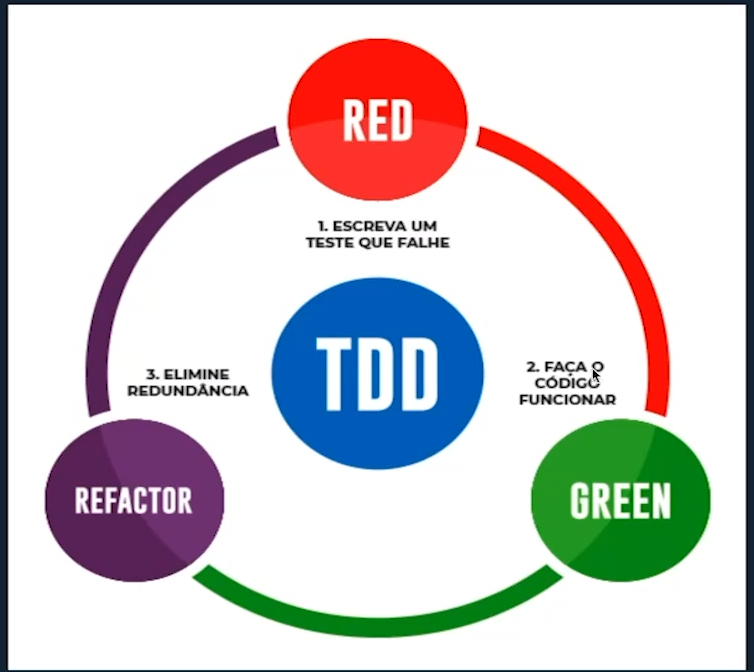

# Ciclo TDD

* Escreva um teste unitário que inicialmente irá falhar, tendo em vista que o código ainda não foi implementado.
* Implemente o código que satisfaça esse teste. Essa implementação deverá satisfazer imediatamente o teste que foi escrito no ciclo anterior.
* Quando o código estiver implementado e o teste satisfeito, refatore o código para melhorar pontos como legibilidade. Logo após, execute o teste novamente. A nova versão do código também deverá passar sem que seja necessario modificar o teste escrito inicialmente.

## Vantagens

* Feedback rápido sobre a nova funcionalidade
* Código mais limpo, já que escremos códigos simples para o teste passar
* Segurança no refactoring pois podemos ver o que estamos ou não afetando
* Segurança na correção de bugs
* Código da aplicação mais flexivel, já que para escrever testes temos que separar em pequenos "pedaços" o nosso código, para que sejam testáveis, ou seja, nosso código estará menos acoplado. 